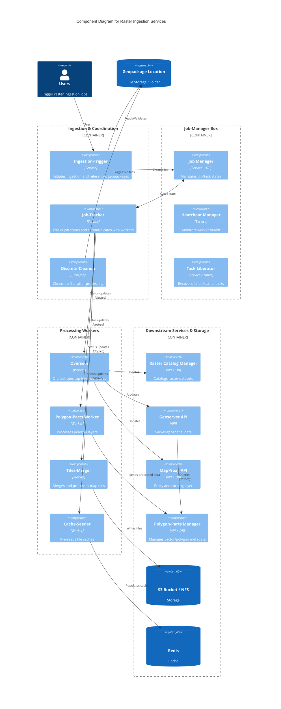

```mermaid
C4Component
    title Component Diagram for Raster Ingestion Services

    Person(users, "Users", "Trigger raster ingestion jobs")
    
    Container_Boundary(ingestion_boundary, "Ingestion & Coordination") {
        Component(trigger, "Ingestion-Trigger", "Service", "Initiates ingestion and references geopackages")
        Component(tracker, "Job-Tracker", "Service", "Tracks job status and communicates with workers")
        Component(cleanup, "Discrete-Cleanup", "Cron Job", "Cleans up files after processing")
    }

    SystemDb(geopackage, "Geopackage Location", "File Storage / Folder")

    Container_Boundary(job_manager_boundary, "Job-Manager Box") {
        Component(job_mgr_core, "Job Manager", "Service + DB", "Maintains job/task states")
        Component(heartbeat, "Heartbeat Manager", "Service", "Monitors worker health")
        Component(liberator, "Task Liberator", "Service / Timer", "Recovers failed/stalled tasks")
    }

    Container_Boundary(workers_boundary, "Processing Workers") {
        Component(overseer, "Overseer", "Worker", "Orchestrates top-level workflows")
        Component(poly_worker, "Polygon-Parts Worker", "Worker", "Processes polygon layers")
        Component(tiles_merger, "Tiles-Merger", "Worker", "Merges and processes map tiles")
        Component(cache_seeder, "Cache-Seeder", "Worker", "Pre-seeds tile caches")
    }

    Container_Boundary(storage_and_apis, "Downstream Services & Storage") {
        Component(catalog, "Raster Catalog Manager", "API + DB", "Catalogs raster datasets")
        Component(geoserver, "Geoserver API", "API", "Serves geospatial data")
        Component(mapproxy, "MapProxy API", "API + DB", "Proxy and caching layer")
        Component(poly_mgr, "Polygon-Parts Manager", "API + DB", "Manages vector/polygon metadata")
        
        SystemDb(s3_nfs, "S3 Bucket / NFS", "Storage", "Stores merged tiles")
        SystemDb(redis, "Redis", "Cache", "Stores seeded map cache")
    }

    %% Relationships
    Rel(users, trigger, "Uses")
    Rel(trigger, geopackage, "Reads/Validates")
    Rel(trigger, job_mgr_core, "Creates Job")
    Rel(cleanup, geopackage, "Purges old files")

    BiRel(job_mgr_core, tracker, "Syncs state")
    Rel(tracker, overseer, "Status updates", "dashed")
    Rel(tracker, poly_worker, "Status updates", "dashed")
    Rel(tracker, tiles_merger, "Status updates", "dashed")
    Rel(tracker, cache_seeder, "Status updates", "dashed")

    %% Workers to Downstream
    Rel(overseer, catalog, "Updates")
    Rel(overseer, geoserver, "Updates")
    Rel(overseer, mapproxy, "Updates")
    
    Rel(poly_worker, poly_mgr, "Sends processed data")
    Rel(tiles_merger, s3_nfs, "Writes tiles")
    Rel(cache_seeder, redis, "Populates cache")
    
    %% Inter-service dependencies
    Rel(geoserver, poly_mgr, "Queries", "dashed")
```
