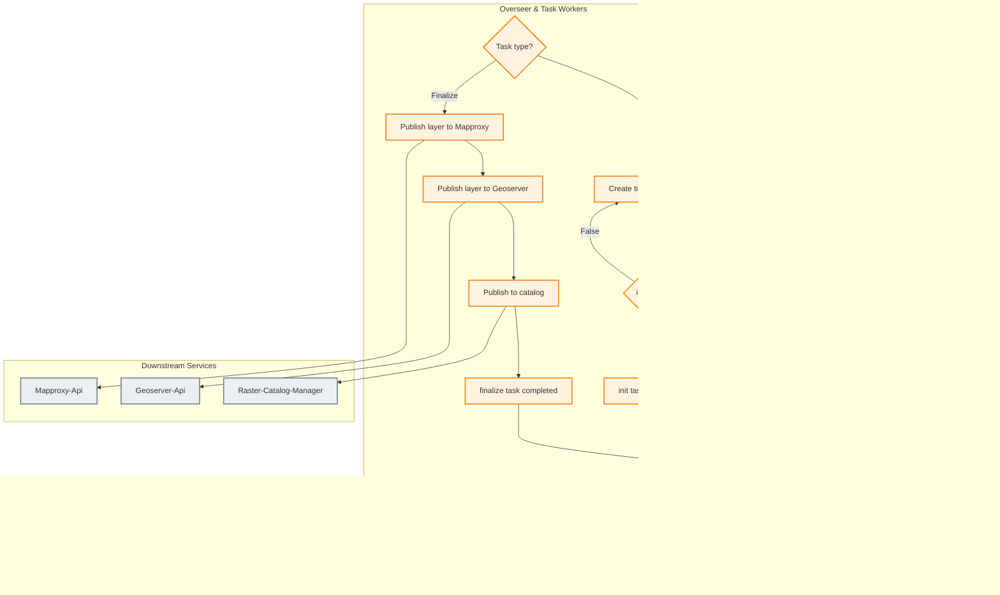

```mermaid
graph TD
    %% Styling and Definitions
    classDef client fill:#f9f9f9,stroke:#333,stroke-width:1px;
    classDef trigger fill:#e1f5fe,stroke:#0288d1,stroke-width:2px;
    classDef manager fill:#e8f5e9,stroke:#388e3c,stroke-width:2px;
    classDef overseer fill:#fff3e0,stroke:#f57c00,stroke-width:2px;
    classDef external fill:#eceff1,stroke:#607d8b,stroke-width:2px;

    %% Client Swimlane
    subgraph Client
        A[Client Ingestion Request]:::client
    end

    %% Ingestion Trigger Swimlane
    subgraph Ingestion_Trigger [Ingestion Trigger]
        B{Validations}:::trigger
        B -- False --> B_Err[Return Error]:::trigger
        B -- True --> C[Create ingestion job by type <br> and Init task]:::trigger
    end

    %% Job Manager Swimlane
    subgraph Job_Manager [Job Manager]
        DM[(Job Manager State / Fork)]:::manager
    end

    %% Overseer / Processing Swimlane
    subgraph Overseer_Process [Overseer & Task Workers]
        E[Get job and task]:::overseer
        F{Task type?}:::overseer
        
        %% Loop Engine
        F -- Init --> G[Create tilesMerging task]:::overseer
        G --> H{isDone?}:::overseer
        H -- False --> G
        H -- True --> I[init task completed]:::overseer
        
        %% Finalize Path
        F -- Finalize --> J[Publish layer to Mapproxy]:::overseer
        K[Publish layer to Geoserver]:::overseer
        L[Publish to catalog]:::overseer
        M[finalize task completed]:::overseer
    end

    %% Downstream Service Integration
    subgraph Downstream_APIs [Downstream Services]
        N[Mapproxy-Api]:::external
        O[Geoserver-Api]:::external
        P[Raster-Catalog-Manager]:::external
    end

    %% Flow Connections
    A --> B
    C --> DM
    DM <==>|Fetch Tasks & Status| E
    
    %% Internal Overseer Loops
    I --> DM
    J --> K --> L --> M
    M --> DM

    %% API Hits
    J --> N
    K --> O
    L --> P
```
