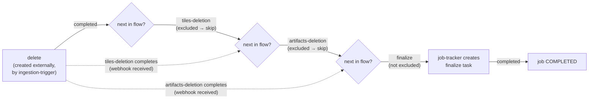

# Delete_Layer Tasks Flow

Deep-dive documentation for the `Delete_Layer` job type support added to job-tracker.
This complements the top-level [README](../README.md) — read that first for the general
service overview, then come here for the full design rationale, architecture, and test
strategy behind this specific feature.

## Table of contents

- [1. Why this exists](#1-why-this-exists)
- [2. Cross-repo context](#2-cross-repo-context)
- [3. job-tracker's generic engine](#3-job-trackers-generic-engine)
- [4. The Delete_Layer design](#4-the-delete_layer-design)
- [5. Every file changed, and why](#5-every-file-changed-and-why)
- [6. Config wiring, end to end](#6-config-wiring-end-to-end)
- [7. The raster-shared dependency problem](#7-the-raster-shared-dependency-problem)
- [8. Test strategy](#8-test-strategy)
- [9. Verification performed](#9-verification-performed)
- [10. Comparison matrix: all four job handlers](#10-comparison-matrix-all-four-job-handlers)
- [11. Known limitations & follow-ups](#11-known-limitations--follow-ups)

---

## 1. Why this exists

MapColonies' raster stack supports deleting an entire layer (tiles, catalog record,
mapproxy/geoserver registration, artifacts). That operation is modeled as its own job
type, `Delete_Layer`, running through the same generic job/task orchestration that every
other job type (`Ingestion_New`, `Ingestion_Update`, `Ingestion_Swap_Update`, `Export`,
`TilesSeeding`) already uses. job-tracker is the service that owns that orchestration: it
reacts to task-completion webhooks and decides what happens next in a job's lifecycle.

Before this change, job-tracker had **no knowledge of `Delete_Layer` at all** — a task
notification for a deletion job would have hit the `default` branch of the job handler
factory and thrown a `BadRequestError`. This document describes what was added to make
job-tracker a first-class participant in that flow.

## 2. Cross-repo context

This feature spans several repositories, and understanding job-tracker's slice requires
knowing what the others already do (as of when this was implemented):

| Repo                | Role                                             | State found                                                                                                                                                                                                                                                                                                                                                                                   |
| ------------------- | ------------------------------------------------ | --------------------------------------------------------------------------------------------------------------------------------------------------------------------------------------------------------------------------------------------------------------------------------------------------------------------------------------------------------------------------------------------- |
| `raster-shared`     | Shared types/schemas/constants (npm package)     | Defines `DeletionJobTypes.Delete_Layer`, `DeletionTaskTypes.{Delete, LayerTilesDeletion, ArtifactsDeletion}`, and the Zod schemas for each task's parameters — but **only on the `alpha` branch/dist-tag**, not in any stable release.                                                                                                                                                        |
| `ingestion-trigger` | Initiates ingestion/deletion jobs                | Already pinned to `raster-shared@8.3.0-alpha.0`. Its `IngestionManager.deleteLayer()` creates a `Delete_Layer` job with **exactly one task**, type `delete`, params `{ deleteFromCatalog: false, deleteFromMapproxy: false, deleteFromGeoserver: false, deletePolygonParts: false }` (all flags currently hardcoded `false` — this part of the pipeline is itself still incomplete upstream). |
| `cleaner`           | Worker that dequeues and executes deletion tasks | Only has a `tilesDeletionStrategy`, and its `worker.capabilities.pairs` config currently only pairs `tiles-deletion` with `Ingestion_Update` / `Ingestion_Swap_Update` — **not** with `Delete_Layer`. No strategy exists yet for `delete` or `artifacts-deletion`.                                                                                                                            |
| `job-tracker`       | Orchestrates the task flow (this repo)           | **Nothing** — the subject of this change.                                                                                                                                                                                                                                                                                                                                                     |

The practical implication: as of this change, nothing in the ecosystem actually _executes_
the `delete`, `tiles-deletion`, or `artifacts-deletion` tasks for a `Delete_Layer` job yet.
job-tracker's job is to have the routing skeleton correctly in place so that when the rest
of the ecosystem catches up (cleaner adds a `Delete_Layer` pairing, something starts
consuming `delete`/`artifacts-deletion`), the sequencing already works without further
changes here.

## 3. job-tracker's generic engine

Before describing what's new, here's the mechanism every job handler (including the new
one) plugs into. This is pre-existing code, but understanding it precisely is essential to
understanding why `Delete_Layer` was wired the way it was.

### Request flow

```
POST /tasks/:taskId/notify
  → TasksController.handleTaskNotification
    → TasksManager.handleTaskNotification(taskId)
        1. findTask(taskId)                     — must be COMPLETED or FAILED, else 428
        2. jobManager.getJob(task.jobId)
        3. getJobHandler(job.type, ...)          — factory picks the concrete handler
        4. handler.handleFailedTask()            — if task failed
           handler.handleCompletedNotification() — if task completed
```

### The handler hierarchy

```
IJobHandler (interface)
  └─ BaseJobHandler (abstract)      — completeJob / failJob / suspendJob / updateJobProgress
       └─ JobHandler (abstract)     — task-flow-aware: tasksFlow, excludedTypes, blockedDuplicationTypes
            ├─ IngestionJobHandler
            ├─ ExportJobHandler
            ├─ SeedJobHandler
            └─ DeleteLayerJobHandler   ← new
```

`JobHandler` composes a `TaskHandler` (in [`taskHandler.ts`](../src/tasks/handlers/taskHandler.ts))
that does the actual sequencing math:

```ts
public getNextTaskType(): TaskTypeItem | undefined {
  const indexOfCurrentTask = this.tasksFlow.indexOf(this.task.type);
  let nextTaskTypeIndex = indexOfCurrentTask + 1;

  // walk forward past any task type marked as "excluded" (skip)
  while (nextTaskTypeIndex < this.tasksFlow.length) {
    const nextTaskType = this.tasksFlow[nextTaskTypeIndex];
    if (nextTaskType === undefined || !this.shouldSkipTaskCreation(nextTaskType)) break;
    nextTaskTypeIndex++;
  }

  if (nextTaskTypeIndex >= this.tasksFlow.length) return undefined;
  return this.tasksFlow[nextTaskTypeIndex];
}

public shouldSkipTaskCreation(taskType: string): boolean {
  return this.excludedTypes.includes(taskType);
}
```

And [`jobHandler.ts`](../src/tasks/handlers/jobHandler.ts)'s `handleCompletedNotification`
decides what to do with that result:

```ts
public async handleCompletedNotification(): Promise<void> {
  const nextTaskType = this.taskWorker?.getNextTaskType();

  if (nextTaskType == undefined) {           // end of the flow
    await this.handleNoNextTask();           // → completeJob() or updateJobProgress()
    return;
  }
  if (!this.isProceedable()) {               // per-task-type business rule (e.g. validation)
    await this.suspendJob(this.task.reason);
    return;
  }
  if (!this.isReadyForNextTask() || this.shouldSkipTaskCreation(nextTaskType)) {
    await this.handleSkipTask(nextTaskType);  // → updateJobProgress() only
    return;
  }
  await this.createNewTask(nextTaskType);     // → jobManager.createTaskForJob(...)
}
```

Two concepts matter most for `Delete_Layer`:

- **`excludedTypes`** — task types this handler will _never actively create_ via
  `createTaskForJob`, because it doesn't have the real, per-instance parameters needed
  (e.g. a `catalogId` or a list of S3 paths). Something else creates those tasks directly.
  The handler still processes completion webhooks for them (`shouldSkipTaskCreation`
  causes `getNextTaskType` to walk _past_ them when computing what to create next, but the
  webhook for their own completion is handled exactly like any other task).
- **`isReadyForNextTask()`** — `job.completedTasks === job.taskCount`. This is what
  prevents job-tracker from racing ahead and creating the next task before _every_
  currently-existing task for the job (including ones it didn't create itself) has
  finished.

### Static task parameters

Whenever job-tracker _does_ create a task, it needs static parameters for it, resolved by
job-type + task-type from a fixed map in [`mappers.ts`](../src/common/mappers.ts):

```ts
const key: JobAndTask = `${jobType}_${taskType}`;
const parameters = this.taskParametersMapper.get(key);
if (parameters === undefined) throw new BadRequestError(`task parameters for ${key} do not exist`);
```

This is a hard constraint: **job-tracker can only auto-create a task type if its
parameters are the same every time** (or empty). This is precisely why `tiles-deletion`
and `artifacts-deletion` had to be excluded rather than auto-created — their parameters
(`catalogId`, `paths`, `sourceProvider`, `bucket`) are per-layer, dynamic data that
job-tracker has no way to produce generically.

## 4. The Delete_Layer design

### The flow



Configured as (`taskFlowManager.deleteLayerTasksFlow`):

```json
["delete", "tiles-deletion", "artifacts-deletion", "finalize"]
```

Walking through what actually happens for each possible completion notification, given
`excludedTypes = [tiles-deletion, artifacts-deletion]`:

| Task that completed  | `getNextTaskType()` result                                 | Condition                                                           | Behavior                                                                   |
| -------------------- | ---------------------------------------------------------- | ------------------------------------------------------------------- | -------------------------------------------------------------------------- |
| `delete`             | skips `tiles-deletion` + `artifacts-deletion` → `finalize` | `completedTasks === taskCount`                                      | creates `finalize`                                                         |
| `delete`             | same                                                       | `completedTasks !== taskCount` (other deletion tasks still pending) | progress update only                                                       |
| `tiles-deletion`     | skips `artifacts-deletion` → `finalize`                    | ready                                                               | creates `finalize`                                                         |
| `artifacts-deletion` | → `finalize`                                               | ready                                                               | creates `finalize`                                                         |
| `finalize`           | `undefined` (end of flow)                                  | `taskType === Finalize` in `BaseJobHandler.isJobCompleted`          | job **COMPLETED**                                                          |
| any task, `FAILED`   | —                                                          | `delete` is not in `suspendingTaskTypes`                            | job **FAILED** (default `JobHandler.handleFailedTask`, no override needed) |

Why `delete`, `tiles-deletion`, and `artifacts-deletion` can be created **in any order
relative to each other** from job-tracker's point of view: it never creates them itself
(all three are either the pre-existing first task or excluded), so whichever one's
completion webhook arrives, `isReadyForNextTask()` is the real gate — job-tracker only
moves to `finalize` once every task that exists for the job (regardless of who created it
or in what order) is done.

### The handler implementation

[`src/tasks/handlers/deleteLayer/deleteLayerHandler.ts`](../src/tasks/handlers/deleteLayer/deleteLayerHandler.ts):

```ts
@injectable()
export class DeleteLayerJobHandler extends JobHandler {
  protected readonly tasksFlow: TaskTypes;
  protected readonly excludedTypes: TaskTypes;
  protected readonly blockedDuplicationTypes: TaskTypes;

  public constructor(/* … */) {
    super(logger, config, jobManagerClient, job, task);
    this.tasksFlow = this.config.get('taskFlowManager.deleteLayerTasksFlow') as unknown as TaskTypes;
    this.excludedTypes = [this.jobDefinitions.tasks.tilesDeletion, this.jobDefinitions.tasks.artifactsDeletion];
    this.blockedDuplicationTypes = [this.jobDefinitions.tasks.finalize];

    this.initializeTaskOperations();
  }
}
```

Design choices explained:

- **No `isJobCompleted` override.** Unlike `SeedJobHandler` (which overrides it because a
  seed job has no `finalize` step at all), `Delete_Layer` ends in `finalize` just like
  ingestion/export, so the inherited `BaseJobHandler.isJobCompleted` (`completedTasks ===
taskCount && taskType === TaskTypes.Finalize`) is correct as-is.
- **No `isProceedable` override / proceed rule.** Ingestion registers a
  `ValidationProceedRule` because a validation task can be "completed but invalid" and
  needs to suspend the job instead of proceeding. Nothing in the `Delete_Layer` flow has
  an equivalent conditional-proceed semantic, so the default (`isProceedable` always
  returns `true` unless a rule is registered) is correct.
- **No `handleFailedTask` override.** Export overrides this to special-case a "create an
  error-callback finalize task instead of just failing" behavior. Nothing in the ticket
  scope called for that for deletion, so the default `JobHandler.handleFailedTask` (fail
  the job, unless the task type is in `suspendingTaskTypes`) applies as-is.
- **`blockedDuplicationTypes = [finalize]`** rather than mirroring `ExportJobHandler`
  (which blocks duplication on the excluded type itself). The rationale: `blockDuplication`
  only has any effect on task types job-tracker actually creates via `createTaskForJob` —
  and in this handler that's only ever `finalize`. Protecting the one task type this
  handler actually creates from double-creation (e.g. if two completion webhooks for
  different upstream tasks arrive close together) is the meaningful protection here.

## 5. Every file changed, and why

| File                                                      | Change                                                                                                                                                                                                                                                                                                                         |
| --------------------------------------------------------- | ------------------------------------------------------------------------------------------------------------------------------------------------------------------------------------------------------------------------------------------------------------------------------------------------------------------------------ |
| `package.json`                                            | `@map-colonies/raster-shared` bumped `^7.10.2` → `8.3.0-alpha.0` (exact pin). See [§7](#7-the-raster-shared-dependency-problem).                                                                                                                                                                                               |
| `package-lock.json`                                       | Regenerated by `npm install` for the above.                                                                                                                                                                                                                                                                                    |
| `src/common/interfaces.ts`                                | Added `jobs.deleteLayer`, `tasks.delete`, `tasks.artifactsDeletion` to `IJobDefinitionsConfig`. (`tasks.tilesDeletion` already existed in the interface but had never been populated in `config/default.json` — that gap is now also closed.)                                                                                  |
| `src/common/mappers.ts`                                   | Added a `${jobs.deleteLayer}_${tasks.finalize} → {}` entry — required because job-tracker creates the `finalize` task itself and the mapper throws if no entry exists for a job+task combination it tries to create.                                                                                                           |
| `src/tasks/handlers/deleteLayer/deleteLayerHandler.ts`    | **New.** The handler itself — see [§4](#4-the-delete_layer-design).                                                                                                                                                                                                                                                            |
| `src/tasks/handlers/jobHandlerFactory.ts`                 | Added the `jobDefinitions.jobs.deleteLayer` case to the factory switch.                                                                                                                                                                                                                                                        |
| `config/default.json`                                     | Added `jobDefinitions.jobs.deleteLayer`, the three new/completed task entries, and `taskFlowManager.deleteLayerTasksFlow`. This is the single source of truth for local dev and tests (`config/test.json` and `config/production.json` are both `{}` — everything is either defaulted here or overridden by env vars in prod). |
| `config/custom-environment-variables.json`                | Env var names for every new/completed config key, so helm can inject real values in each deployed environment.                                                                                                                                                                                                                 |
| `helm/values.yaml`                                        | Chart defaults for the new job/task types and the new flow array.                                                                                                                                                                                                                                                              |
| `helm/templates/configmap.yaml`                           | Renders the new env vars (`JOB_DEFINITIONS_JOB_DELETE_LAYER`, `JOB_DEFINITIONS_TASK_DELETE`, `JOB_DEFINITIONS_TASK_ARTIFACTS_DELETION`, `DELETE_LAYER_TASKS_FLOW`) into the ConfigMap.                                                                                                                                         |
| `tests/mocks/configMock.ts`                               | Test-side mirror of `config/default.json` — same additions, plus the previously-missing `tilesDeletion`/`delete`/`artifactsDeletion` task entries needed for any test to reference them.                                                                                                                                       |
| `tests/mocks/jobMocks.ts`                                 | New `getDeleteLayerJobMock()`, mirroring the existing `getExportJobMock`/`getSeedingJobMock` pattern.                                                                                                                                                                                                                          |
| `tests/unit/tasks/handlers/jobHandler.spec.ts`            | Added a `Delete_Layer` case to the generic cross-handler `testCases` array — see [§8](#8-test-strategy).                                                                                                                                                                                                                       |
| `tests/unit/tasks/handlers/jobHandlerFactory.spec.ts`     | New test: factory returns a `DeleteLayerJobHandler` instance for the `deleteLayer` job type.                                                                                                                                                                                                                                   |
| `tests/integration/tasks/deleteLayer/taskManager.spec.ts` | **New.** Full HTTP-level integration suite — see [§8](#8-test-strategy).                                                                                                                                                                                                                                                       |

## 6. Config wiring, end to end

Every new job/task identifier and the new flow array had to be threaded through **four**
layers consistently, since a mismatch at any layer means the wrong value (or `undefined`)
in some environment:

```
config/default.json                    (local dev / test fallback values)
        │
config/custom-environment-variables.json   (maps config keys → env var names)
        │
helm/values.yaml                        (chart default values, per-environment overridable)
        │
helm/templates/configmap.yaml           (renders the actual env vars injected at deploy time)
```

Concretely, for the job type:

| Layer                               | Value                                                                                    |
| ----------------------------------- | ---------------------------------------------------------------------------------------- |
| `config/default.json`               | `jobDefinitions.jobs.deleteLayer = "Delete_Layer"`                                       |
| `custom-environment-variables.json` | `jobDefinitions.jobs.deleteLayer = "JOB_DEFINITIONS_JOB_DELETE_LAYER"`                   |
| `helm/values.yaml`                  | `jobDefinitions.jobs.deleteLayer.type: ''` (filled in per-environment values override)   |
| `helm/templates/configmap.yaml`     | `JOB_DEFINITIONS_JOB_DELETE_LAYER: {{ $jobDefinitions.jobs.deleteLayer.type \| quote }}` |

And the same four-layer pattern for `tasks.delete`, `tasks.artifactsDeletion`, and
`taskFlowManager.deleteLayerTasksFlow` (the last one is a JSON-encoded array end-to-end:
`DELETE_LAYER_TASKS_FLOW` env var → parsed back into an array by the `@map-colonies/config`
library via the `__format: "json"` directive in `custom-environment-variables.json`).

This was validated by rendering the actual chart (see [§9](#9-verification-performed)) —
not just by eyeballing the four files — since Helm's Go-templating syntax isn't valid
standalone YAML and a plain YAML linter can't confirm correctness (the IDE's inline
diagnostics on `configmap.yaml` during this work were exactly that false-positive: they
flagged the _new_ lines using the identical `{{ }}` pattern already used everywhere else
in the file).

## 7. The raster-shared dependency problem

This was the most consequential discovery during investigation, because it blocks the
feature at the type level, not just the routing level.

- `raster-shared`'s `DeletionJobTypes`/`DeletionTaskTypes`/`DeleteLayerJobParams`/
  `DeleteTaskParams` were added in commit `8d50c52` ("feat: add layer deletion schemas,
  types and constants (MAPCO-7285)"), which landed on the **`alpha` branch**.
- Checked the CHANGELOG entry ("add tile deletion schemas and types", #191) — it appears
  under `8.1.0-alpha.0`, which _looks_ like it should have rolled into the stable `8.1.0`
  release. It did not: `git ls-tree` on the commit that produced the published `8.2.0`
  package (`6aad051`, "bump version from 8.1.0 to 8.2.0") confirms **no `deletion`
  directory exists in that commit**. The alpha and stable release trains have diverged.
- The only place these types exist in a published package is the `alpha` dist-tag,
  currently `8.3.0-alpha.1` (confirmed via `npm pack @map-colonies/raster-shared@alpha`).
- `ingestion-trigger` already depends on `raster-shared@8.3.0-alpha.0` (exact pin, not a
  caret range) — this repo's `package.json` now matches that exact version for
  consistency between the two services consuming the same in-flight schema.
- Confirmed no breaking change from the `8.0.0-alpha.0` release (which _did_ have a
  genuine breaking change — "change polygon part validation error to new format,
  MAPCO-10506") affects job-tracker: this repo only imports `TaskTypes`,
  `ExportFinalizeType`, the ingestion/export finalize param types, and
  `ingestionValidationTaskParamsSchema` (just `.pick({isValid: true})` off it) — none of
  which touch the polygon-parts validation error shape. `tsc --noEmit` after the bump
  confirmed this empirically.

**Action item for whoever owns this long-term:** once `raster-shared`'s deletion
feature ships in a stable release, both `job-tracker` and `ingestion-trigger` need to move
off the alpha pin together, to a matching stable version.

## 8. Test strategy

### Unit tests

`tests/unit/tasks/handlers/jobHandler.spec.ts` runs a shared battery of generic behavior
assertions across **every** job handler type, driven by one `testCases` array. Adding
`{ mockJob: createTestJob(jobs.deleteLayer), taskType: tasks.delete }` to that array gets
`Delete_Layer` covered, for free, by:

- `handleFailedTask` → fails the job with the task's reason.
- `handleCompletedNotification` on `finalize`, all tasks done → completes the job at 100%.
- `handleCompletedNotification` when `isProceedable()` is mocked `false` → suspends the job.
- `handleCompletedNotification` when the task is still `IN_PROGRESS` → progress update only, no task created.
- `handleCompletedNotification` when other tasks in the job are still incomplete → progress update only, no task created.

`tests/unit/tasks/handlers/jobHandlerFactory.spec.ts` adds one targeted test: the factory
returns a `DeleteLayerJobHandler` instance for `jobDefinitions.jobs.deleteLayer`.

### Integration tests

`tests/integration/tasks/deleteLayer/taskManager.spec.ts` drives the actual Express app
through `supertest`, with `nock` mocking every job-manager HTTP call, validating each
response against the OpenAPI spec (`toSatisfyApiSpec()`). Unlike the unit tests, this
exercises the **real** `TaskHandler.getNextTaskType()` / `shouldSkipTaskCreation()` logic
against the real `deleteLayerTasksFlow` array — nothing here is mocked at that layer, so
these tests are what actually prove the skip-over-excluded-types sequencing works, not
just that the handler wires up.

| #   | Scenario                                                                              | Asserts                                                                                                                               |
| --- | ------------------------------------------------------------------------------------- | ------------------------------------------------------------------------------------------------------------------------------------- |
| 1   | `delete` completes, `completedTasks === taskCount` (nothing else pending)             | `finalize` task created with `blockDuplication: true`, `parameters: {}`; job progress updated                                         |
| 2   | `delete` completes, `completedTasks < taskCount` (other deletion tasks still pending) | **no** task created; progress updated only                                                                                            |
| 3a  | `tiles-deletion` completes, ready                                                     | correctly walks past the (already-passed) excluded type, creates `finalize`                                                           |
| 3b  | `artifacts-deletion` completes, ready                                                 | same, one step later in the flow                                                                                                      |
| 4   | `finalize` completes                                                                  | job transitions to `COMPLETED` at 100%                                                                                                |
| 5   | `delete` fails                                                                        | job transitions to `FAILED` with the task's reason (default `handleFailedTask`, no suspend — `delete` isn't in `suspendingTaskTypes`) |

### Results

```
Unit:        134/134 passing, 100% statements/branches/functions/lines on the new handler
Integration:  96/96 passing (5 new scenarios, one parameterized over 2 excluded task types)
```

## 9. Verification performed

Beyond the automated test suites:

- `tsc --noEmit` — clean after the `raster-shared` bump (confirms no breaking-change fallout).
- `eslint .` — clean.
- `prettier --check .` — clean (one formatting fix applied to the new integration spec).
- **Helm chart rendering** — since the chart has an external OCI dependency (`mclabels`)
  not resolvable offline, the chart was copied to a scratch directory, the dependency
  block stripped, and a minimal local stub for the `mclabels.labels`/`mclabels.
selectorLabels` template functions was added just to satisfy `helm template`'s parser.
  Rendering `templates/configmap.yaml` confirmed every new env var (including the
  JSON-encoded `DELETE_LAYER_TASKS_FLOW`) renders correctly. This is real evidence, not
  just visual inspection — Helm's Go-templating means a file can look syntactically odd to
  a plain-YAML linter while still being perfectly valid, and the only way to know for sure
  is to actually render it.

## 10. Comparison matrix: all four job handlers

|                                      | `IngestionJobHandler`                 | `ExportJobHandler`                           | `SeedJobHandler`                | `DeleteLayerJobHandler`                  |
| ------------------------------------ | ------------------------------------- | -------------------------------------------- | ------------------------------- | ---------------------------------------- |
| Ends in `finalize`?                  | ✅                                    | ✅                                           | ❌ (overrides `isJobCompleted`) | ✅                                       |
| `excludedTypes`                      | `[merge, tilesDeletion]`              | `[export]` (the heavy `tilesExporting` step) | `[seed]` (its only task)        | `[tilesDeletion, artifactsDeletion]`     |
| `blockedDuplicationTypes`            | `[validation, createTasks, finalize]` | `[export]`                                   | `[]`                            | `[finalize]`                             |
| Custom `isProceedable`/proceed rule? | ✅ `ValidationProceedRule`            | ❌                                           | ❌                              | ❌                                       |
| Custom `handleFailedTask`?           | ❌ (default)                          | ✅ (error-callback finalize task)            | ❌ (default)                    | ❌ (default)                             |
| First task created by                | job-tracker itself (`validation`)     | external initiator                           | external initiator              | external initiator (`ingestion-trigger`) |

This table is a useful reference the next time a new job type needs to be added — it
makes explicit which knobs actually vary between handlers versus which ones are
essentially always the same.

## 11. Known limitations & follow-ups

- **`raster-shared` alpha pin** — see [§7](#7-the-raster-shared-dependency-problem). This
  is a real, tracked risk: alpha packages can be republished or diverge without the usual
  semver guarantees.
- **Nothing consumes `delete` or `artifacts-deletion` yet**, and `cleaner` doesn't have a
  `Delete_Layer` → `tiles-deletion` pairing configured. job-tracker's routing is correct
  and tested in isolation, but the end-to-end feature isn't runnable in a real environment
  until those other services catch up — this doc's scope was explicitly job-tracker's
  slice only (per your confirmation to go with the full 4-stage flow).
- **`ingestion-trigger` currently hardcodes all four `delete` task flags to `false`**
  (`deleteFromCatalog/Mapproxy/Geoserver/PolygonParts`), so even once a worker consumes
  the `delete` task, it wouldn't currently be told to delete anything from those
  subsystems. Out of scope for job-tracker, but worth knowing if the flow doesn't seem to
  "do" anything end-to-end yet.
- **No dedicated finalize-parameters schema exists in `raster-shared` for deletion** (unlike
  export, which has `ExportFinalizeFullProcessingParams`/`ExportFinalizeErrorCallbackParams`).
  The `mappers.ts` entry therefore uses an empty object. If a future `raster-shared`
  release adds a typed finalize schema for deletion, this mapper entry should be updated
  to use it instead of `{}`.
